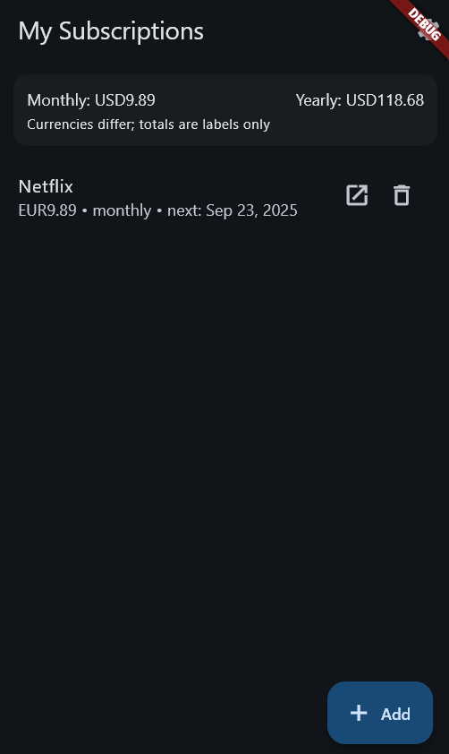
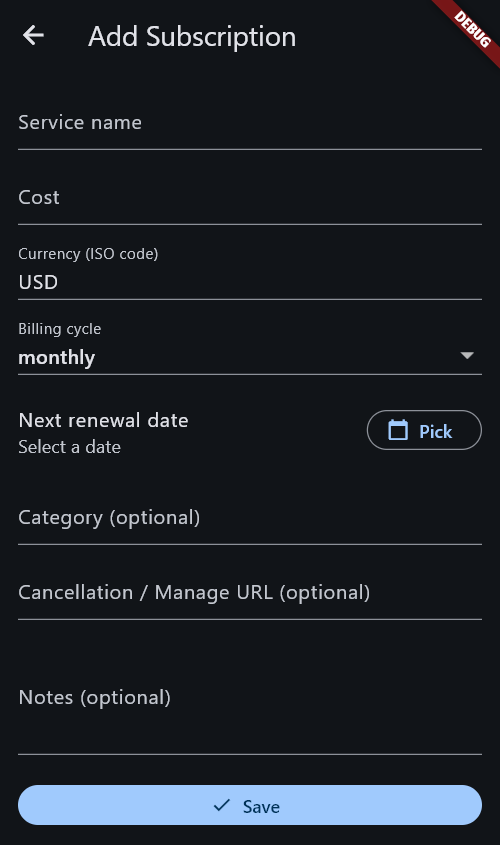
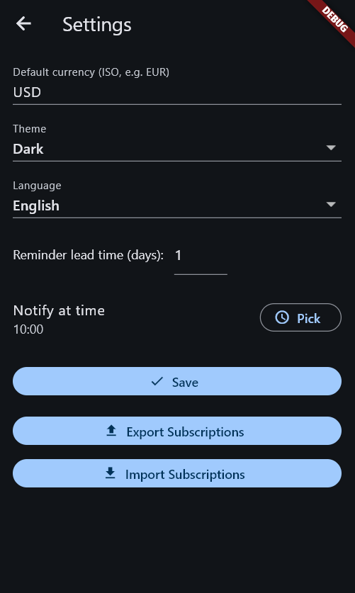

# Subscription Manager (Flutter)

A privacy-first mobile app to track subscriptions, see upcoming renewals, and jump straight to cancellation pages.

---

## ✨ Features (MVP)
- Manual subscription entry (name, cost, renewal date, category, cancel/manage URL)
- Dashboard with monthly/annual totals and upcoming renewals
- Local notifications (reminders before renewal)
- Quick "Cancel/Manage" action (opens cancellation page)
- Preferences (language, currency, theme, notification lead time)
- Data export/import (JSON)
- Multi-language ready (EN/LV/RU)

---

## 🛠 Tech Stack
- **Flutter (Dart)** with MVVM (Provider/ChangeNotifier)
- **Local storage:** Hive (with secure key in platform keystore)
- **Routing:** go_router
- **Notifications:** flutter_local_notifications + timezone
- **i18n:** gen_l10n (ARB files in `lib/l10n/`)

---

## 🚀 Getting Started
```bash
flutter --version   # ensure stable channel
flutter pub get
flutter gen-l10n
flutter analyze
flutter test
flutter run
```

## 📂 Project Scripts

- CI: [`.github/workflows/flutter.yml`](.github/workflows/flutter.yml) runs format check, analyze, and tests automatically on push/PR.

## 📸 Screenshots
<p float="left">
  
  
  
</p>